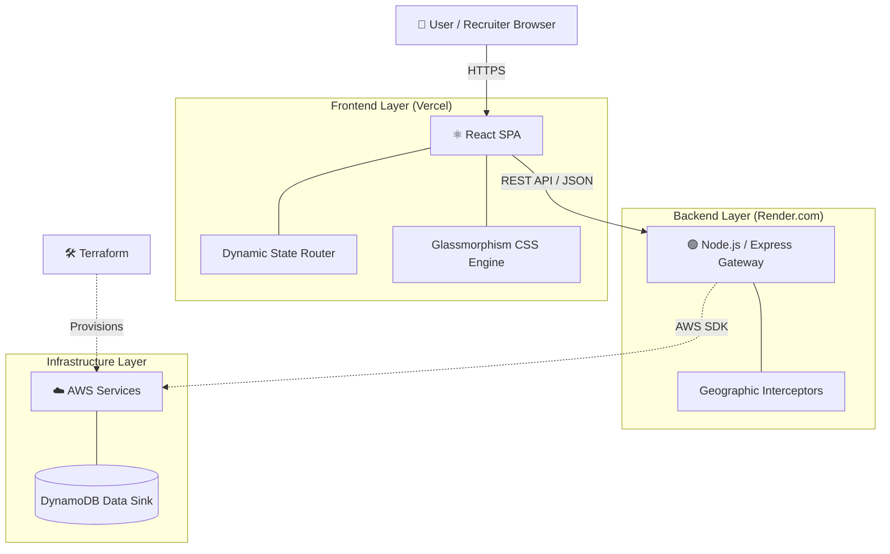

# 🌐 Sovereign Cloud Engine (Elite-Tier)

[](https://sovereign-cloud-engine.vercel.app/)
[]()
[]()

An enterprise-grade, high-availability cloud operations dashboard. Engineered with a heavily decoupled architecture using React, Node.js, and Terraform to simulate automated AWS infrastructure provisioning and strict cross-border data sovereignty compliance.

---

## 🚀 Live Cinematic Demo
**Experience the live platform here:** [https://sovereign-cloud-engine.vercel.app/](https://sovereign-cloud-engine.vercel.app/)

**For the best presentation:**
1. Open the platform in full screen.
2. Toggle the **Region** button (Top Right) to `EU-WEST-1` to trigger strict GDPR compliance protocols.
3. Click the massive **Execute Automated AI Infrastructure Audit** button.
4. Watch the AI type out a live JSON audit report detailing node integrity and encryption standards.
5. Click the **Administrator** tab and use the live Command Line Interface (`ping`, `audit`).

---

## 🏗️ Cloud Architecture Diagram

The system is built on a modern, decoupled microservice architecture:



---

## 🛠️ Frontend Architecture & Tech Stack

Built with a strict focus on rendering performance, state-machine logic, and systems architecture:

*   **Framework:** React (Vite) for lightning-fast HMR and optimized production bundling.
*   **Routing:** Custom state-driven component mounting for seamless, flicker-free tab switching.
*   **Styling:** Vanilla CSS3 Variables and structural Glassmorphism for an "expensive", high-trust aesthetic.
*   **Micro-Interactions:** Custom dynamic hover-states, synthetic typing delays (Typewriter effect), and sliding glow tabs.
*   **Backend Interception:** Express middleware simulating region-locked data laws (e.g., EU-WEST-1 enforces GDPR strict mode).

## 🚀 Getting Started Locally

To run the simulation platform locally on your own machine:

```bash
# Clone the repository
git clone https://github.com/aakashpandian582006-ops/sovereign-cloud-engine.git
cd sovereign-cloud-engine

# Start the Backend Server (Port 5001)
cd backend
npm install
npm start

# In a new terminal tab, Start the Frontend (Port 5173)
cd ../frontend
npm install
npm run dev
```

Navigate to `http://localhost:5173`. The simulation engine will automatically hydrate and connect to your local Node.js server.
